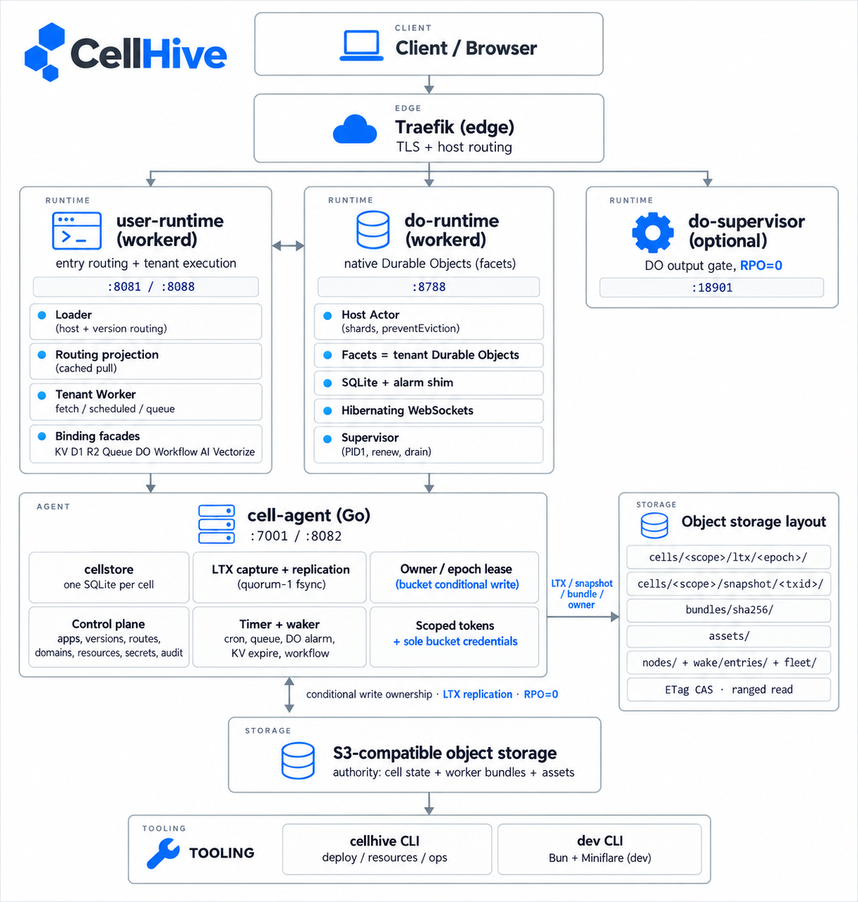

<p align="center">
  
</p>

<p align="center"><strong>自托管、Cloudflare Workers 兼容的运行时。</strong></p>

<p align="center">
  计算层用原版（stock）<a href="https://github.com/cloudflare/workerd">workerd</a> ·
  状态层是 Go 实现的 "cell"（SQLite + S3 兼容对象存储）·
  RPO=0、持久寻址、节点可替换。
</p>

---

## 功能

**Workers 与计算**
- ES module Workers：`fetch`、`scheduled`（Cron）、`queue`（消费者，含批处理/重试/DLQ）。
- Service binding 与 worker↔worker RPC（同实例原生 JSRPC）；Durable Object RPC（`env.NS.get(id).method(...)`）。
- `nodejs_compat`；静态资产，支持 `_headers` / `_redirects` / SPA 回退。

**Durable Objects**
- 原生 facet、同步 SQLite SQL、alarm、可休眠 WebSocket、migrations（`new/renamed/transferred/deleted`）、会话策略、DO 内 bindings、跨节点冷激活与接管。

**绑定**
- KV（强一致、TTL、metadata、list）、D1（SQL、`batch`/`exec`、`meta`）、R2（get/put/head/list、range、multipart、presigned URL）、Queues、Workflows、Cron、Assets、Vars/Secrets（信封加密）、AI（自带端点）、Hyperdrive、Vectorize。

**发布与控制面**
- 兼容 `wrangler.jsonc`；不可变版本；原子 deploy / promote / rollback；域名与路由；自定义域授权；审计日志；按命名空间限流；资源注册表。

**平台与运维**
- cell 复制且持久（RPO=0）；启动用一条命令探测对象存储契约（`cellhive diagnose`）。
- `GET /metrics`、有界 worker 日志 tail、可选 OTLP traces 与 logs。
- 单镜像包含全部服务与 pinned workerd；Docker Compose、Kubernetes（kustomize）、Helm；优雅 drain 与就绪探针。

**多租户与隔离**
- 每个 binding 一个 scoped token（HMAC）；租户 worker 只拿到 binding facade，拿不到平台 secret；租户出网默认仅公网；只有 `cell-agent` 持有桶凭据。

## 架构



| 组件 | 运行时 | 端口 | 职责 |
|---|---|---|---|
| **Traefik / 边缘代理** | 外部 | 80/443 | TLS + host 分流（由运维静态配置） |
| **`user-runtime`** | workerd | `:8081` 公开 / `:8088` 内部 | 入口 loader：host/版本路由与租户执行 |
| **`do-runtime`** | workerd + Go supervisor | `:8788` | 原生 Durable Objects（facet）；分布式弹性；只持工作副本，不是权威 |
| **`do-supervisor`**（可选） | Go | `:18901` | DO 输出门：确认响应的耐久性（RPO=0） |
| **`cell-agent`** | Go | `:7001` 内部 REST / `:8082` admin | cell 存储 + 复制 + owner/epoch 租约 + 控制面 + 计时派发 + **唯一桶凭据** |
| **对象存储** | S3 兼容 | — | cell 状态、worker bundle、assets 的权威 |

**状态模型。** 每个状态单元是一个 **cell**（`<namespace>/<class>/<id>`），各自一份 SQLite。KV namespace、queue、D1 库、workflow、Durable Object 都是 cell，因此共享同一套租约、复制与故障接管。已提交的 SQLite 写被捕获为 **LTX** 并复制到 peer；**bucket 条件写**选出 owner，**所有权 epoch** 围栏写者。单节点靠上传对象存储证明耐久，多节点靠 peer 持有证明（quorum-1 fsync）。所有权带着恢复出的日志一起迁移，已确认的写不会丢。

## 设计思路

1. **不修改 workerd。** 只使用 `workerLoader`、bindings、capnp；绝不 fork 或打补丁。
2. **计算与状态分离。** runtime 只负责执行；所有持久化经 `cell-agent`，它拥有 cell 的 SQLite、复制与桶凭据；runtime 不直接访问对象存储。
3. **一切皆 cell。** 统一的单元（namespace/class/id）+ 每 cell 一份 SQLite，意味着租约、fencing、复制、快照、恢复、清理只有一套机制。
4. **对象存储是权威，不要共识服务。** 条件写决定 owner；LTX + peer fsync 给 RPO=0；持久状态在桶与副本里，本地盘只是工作副本/缓存，所以节点可替换。
5. **兼容性失败即拒绝。** 未知 `wrangler` 字段、未知 compatibility flag、比 pinned workerd 更新的兼容日期，部署期直接拒绝，而不是静默接受。
6. **最小权限。** 租户代码只看到 binding facade 与 scoped token，看不到平台 secret；对象存储凭据只存在于 `cell-agent`。
7. **证据优先。** 每个行为都有测试覆盖；`bash scripts/ci.sh`（lint、vet、单测、真实 workerd 集成、性能、RPO 故障注入、S3、镜像/compose/k8s/helm）必须输出 `GATE: PASS`。

## 快速开始

前置：Go 1.27+、C 工具链（SQLite 经 CGo 构建）、`make`。

```bash
make build     # 构建全部二进制（带必需的 SQLite 构建 tags）
make test      # 单元测试
make vet       # go vet
```

单节点运行（文件系统 bucket，无需外部服务）：

```bash
make run       # 在 :7001 起 cell-agent，用本地 bucket
CELLHIVE_CONTROL_URL=http://127.0.0.1:7001 make diagnose   # 对象存储探针
```

完整本地栈：

```bash
export CELLHIVE_ROOT_KEY=$(openssl rand -base64 32)   # 唯一必配 secret
docker compose -f deploy/compose/docker-compose.yml up --build
# 或：make compose-up
```

`CELLHIVE_ROOT_KEY` 是唯一必配 secret——所有角色凭据都由它 HKDF 派生。

Dev CLI（Bun + Miniflare，**仅开发用**，非生产产物）：

```bash
cd cli && bun install && bun run src/index.ts dev <dir>
```

## 目录

```
cmd/        服务与工具入口（cell-agent、cellhive、user-runtime、do-runtime、do-supervisor、各 bench）
internal/   可复用 Go 包（cellstore、bucket、owner、lease、replica、ltx、server、control 等）
workerd/    workerd JS 平台代码 + capnp 配置（user-runtime/、do-runtime/、platform/）
cli/        dev CLI（Bun + Miniflare；仅开发）
deploy/     Dockerfile、docker-compose、Kubernetes（kustomize）、Helm
docs/       设计文档与决策
scripts/    CI 与运维脚本
```

## 文档

- **文档首页 / 从这里开始**：[`docs/README.md`](./docs/README.md) — 按角色给路径（运维 · 写 Worker · 贡献 · 协议深挖），并按主题分组索引全部文档。
- **模块文档**：[`docs/modules/`](./docs/modules/README.md) — 逐模块给出作用、关键接口、**环境变量表（含默认值）**、不变量、源码与测试锚点。
- **示例代码**：[`examples/`](./examples/README.md) — 每个功能一个可运行示例（KV/D1/R2/Queue/Cron/DO/Workflow/service/assets/AI/Vectorize…），并附"功能→源码→文档"代码导航。
- **概念与设计**：[`architecture.md`](./docs/architecture.md)、[`cell-protocol.md`](./docs/cell-protocol.md)、[`durable-objects.md`](./docs/durable-objects.md)、[`protocol-formats.md`](./docs/protocol-formats.md)、[`glossary.md`](./docs/glossary.md)。
- **绑定与兼容**：[`bindings.md`](./docs/bindings.md)、[`compatibility-matrix.md`](./docs/compatibility-matrix.md)、[`wrangler-compat.md`](./docs/wrangler-compat.md)。
- **存储、复制与伸缩**：[`storage-and-s3.md`](./docs/storage-and-s3.md)、[`scaling-and-ha.md`](./docs/scaling-and-ha.md)、[`timers-and-dispatch.md`](./docs/timers-and-dispatch.md)。
- **运行与运维**：[`deployment.md`](./docs/deployment.md)、[`configuration.md`](./docs/configuration.md)、[`operations.md`](./docs/operations.md)、[`observability.md`](./docs/observability.md)、[`testing.md`](./docs/testing.md)。
- **决策记录**：[`docs/decisions.md`](./docs/decisions.md)。

## 贡献

- 先读 [`docs/contributing.md`](./docs/contributing.md)：按改动类型给出阅读路径与测试锚点。
- 提交前跑 `bash scripts/ci.sh`，必须输出 `GATE: PASS`。
- 设计与代码同步：改代码要同步改文档（含 `docs/decisions.md`）。
- 不 fork / 不修改 workerd；只通过 `workerLoader`、bindings、capnp 扩展。

## 许可

CellHive 复用了一部分 Apache-2.0 许可的代码与设计；使用/再分发这些部分时请保留对应的 `LICENSE`/`NOTICE` 与署名（见 [`docs/decisions.md`](./docs/decisions.md) ADR-016）。

English README: [`README.md`](./README.md)。
